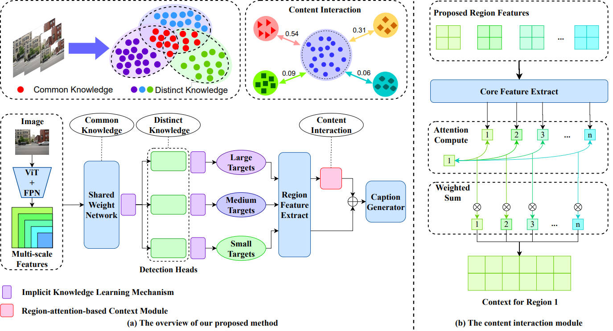
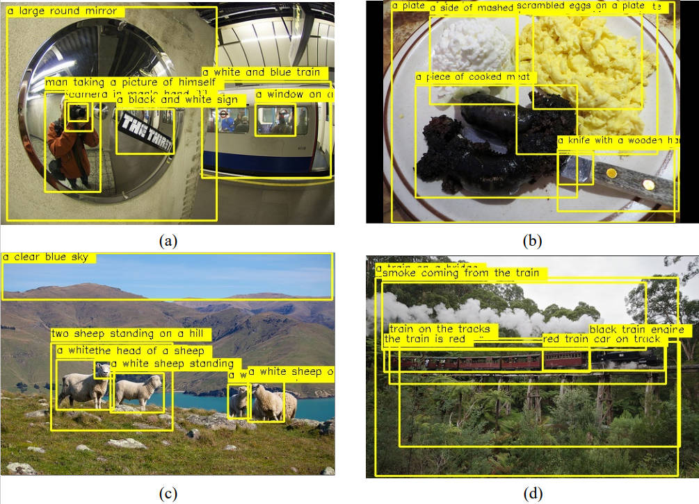

# CDKM: Common and Distinct Knowledge Mining Network with Content Interaction for Dense Captioning
The dense captioning task aims at detecting multiple salient regions of an image and describing them separately in natural language. Although significant advancements have been made in recent years in the field
of dense captioning, there are still some limitations to existing methods. On the one hand, most dense captioning methods lack strong target detection capabilities and struggle to cover all relevant content when dealing with target-intensive images. On the other hand, current transformer-based methods are powerful but neglect the acquisition and utilization of contextual information, hindering the visual understanding of local areas. To address these issues, we propose a common and distinct knowledge-mining network with content interaction for the task of dense captioning. Our network has a knowledge mining mechanism that improves the detection of salient targets by capturing common and distinct knowledge from multi-scale features. We further propose a content interaction module that combines region features into a unique context based on their correlation. Our experiments on various benchmarks have shown that the proposed method outperforms the current state-of-the-art methods.


## Installation
clone this repository,and build it with the following command.
```
cd ~/pythia
python setup.py build develop
# install nlr-eval
# use the repo below instead of https://github.com/Maluuba/nlg-eval.git
# note: you also need to have java on your machine
pip install git+https://github.com/Maluuba/nlg-eval.git@master
```

## Datasets
The dataset used by CDKM is Visual Genome
Please follow dataset preparation instructions to download datasets.
https://www.kaggle.com/datasets/dannywu375/visualgenome?select=images2


## Overview
The framework of the proposed method



## Training
Methods for Training CDKM Models on the Visual Genome Training Set:
```
python train_net.py --tasks captioning --datasets vg --model cdkm \
--config configs/Base.yml \
--save_dir save/CDKM \
training_parameters.data_parallel True
```

## Evaluator
There are two steps to evaluate the trained model.
First, generate the prediction file with the trained snapshots:
```
python cdkm/evaluation/eval.py --tasks captioning --datasets vg --model cdkm \
--config configs/Base.yml \
--save_dir save/CDKM \
--run_type val --evalai_inference 1 \
--resume_file save_model_path
```
Second, evaluate the prediction file:
```
python cdkm/evaluation/eval.py --set val --pred_file prediction_file_path
```


## Test
You can generate the prediction file on TextCaps test split and submit it to the TextCaps EvalAI server.
```
python train_net.py --tasks captioning --datasets vg --model cdkm \
--config configs/Base.yml \
--save_dir save/CDKM \
--run_type inference --evalai_inference 1 \
--resume_file save_model_path
```


For more details, please follow the [file]('README2.md').

## Visualization
Some of the visualizations results from our proposed method on VG v1.2 test split



## Acknowledgement
Part of our code comes from the following work, and we are very grateful for their contributions to relevant research:
[GRiT](https://github.com/JialianW/GRiT),
[Detic](https://github.com/facebookresearch/Detic),
[CenterNet2](https://github.com/xingyizhou/CenterNet2),
[detectron2](https://github.com/facebookresearch/detectron2),
[GIT](https://github.com/microsoft/GenerativeImage2Text), and
[transformers](https://github.com/huggingface/transformers). 
We thank the authors and appreciate their great works!

